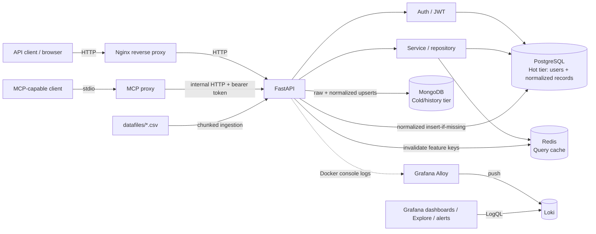

# DataBix Open

# Project summary - DataBix-open
- DataBix-open is a containerized FastAPI microservice for authenticated short-selling data ingestion and retrieval.
- It stores normalized, query-ready records in PostgreSQL (hot tier) and source history in MongoDB (cold tier).
- Chunked CSV ingestion is idempotent; Redis caches filtered API queries and is invalidated after new data is written.
- Docker Compose orchestrates the API, databases, cache, Nginx, Grafana, Loki, and Grafana Alloy.
- GitHub Actions runs tests and Compose health checks, then publishes multi-architecture application images to GHCR.

DataBix-open is a blueprint for a small data service with clear API, ingestion, persistence, authentication, caching, and observability layers.

## Contents

- [Features](#features)
- [Architecture](#architecture)
- [Data flow and storage](#data-flow-and-storage)
- [API](#api)
- [Run locally with Docker Compose](#run-locally-with-docker-compose)
- [Configuration and security](#configuration-and-security)
- [Tests and CI/CD](#tests-and-cicd)
- [Deployment notes](#deployment-notes)
- [Documentation](#documentation)

## Features

- FastAPI REST API with OAuth2 password login, bcrypt password hashing, and JWT bearer authentication.
- PostgreSQL as the hot relational store for users and normalized short-selling records.
- MongoDB as the cold/history store for raw source rows and their normalized projection.
- Chunked CSV ingestion with content hashing, deterministic source-row identity, and repeat-load deduplication.
- Redis cache for filtered and paginated short-selling responses, with cache invalidation after new records are written.
- MCP stdio tool that proxies the authenticated short-selling API rather than bypassing application logic.
- Docker Compose stack with Nginx, Grafana, Loki, and Alloy log collection.
- GitHub Actions tests, Compose validation/health check, and GHCR image publishing.

## Architecture



The CSV folder is mounted into the backend container read-only. Alloy discovers containers labeled for log collection; the backend currently has that label. Grafana queries Loki; Alloy is the collector and Loki is the log store.

## Data flow and storage

### Hot and cold tiers

- **PostgreSQL (hot tier):** stores users and normalized records in `short_selling_master` for indexed, filtered API queries. The generated record ID is the primary key. Date/symbol pairs are indexed but are intentionally not unique.
- **MongoDB (cold/history tier):** stores raw CSV values and normalized row data in `short_selling_history`. A deterministic document ID incorporates source identity and row number.
- **Redis (cache tier):** stores serialized API pages keyed by all query filters and pagination values. Entries expire after 300 seconds. Redis failures on reads/writes fall back to PostgreSQL; new PostgreSQL inserts invalidate the short-selling cache namespace.

### CSV ingestion

The CSV schema is `Date`, `Symbol`, `Security Name`, and `Quantity`. The parser reads in chunks, validates columns, parses `DD-MMM-YYYY` dates, normalizes symbols to uppercase, handles comma-formatted integer quantities, and skips `-` quantity sentinels while reporting the skipped count.

Ingestion performs two database passes:

1. Upsert raw rows and normalized projections into MongoDB.
2. Insert normalized rows into PostgreSQL, skipping rows already imported from the same source content and row number.
3. Invalidate relevant Redis cache entries after new PostgreSQL rows are written.

MongoDB and PostgreSQL do not share a transaction. If the PostgreSQL pass fails after MongoDB completes, retrying is safe: MongoDB upserts are repeatable and PostgreSQL deduplicates source rows. The HTTP ingestion route is synchronous; clients should wait for its response before starting another load.

## API

Base path: `/api/v1`. Interactive OpenAPI documentation is available at `/docs` when the service is running.

| Method | Endpoint | Authentication | Purpose |
| --- | --- | --- | --- |
| `GET` | `/health` | Public | Liveness response |
| `POST` | `/api/v1/auth/signup` | Public | Create a user account |
| `POST` | `/api/v1/auth/token` | Public | Obtain a JWT using OAuth2 form fields `username` and `password` |
| `GET` | `/api/v1/users/me` | Bearer token | Return the current active user |
| `POST` | `/api/v1/short-selling/ingest` | Bearer token | Ingest the bundled CSV or a named CSV in `datafiles/` |
| `GET` | `/api/v1/short-selling` | Bearer token | Return filtered, paginated records |

Short-selling query parameters:

- `date_from`, `date_to`: ISO dates (`YYYY-MM-DD`), inclusive.
- `symbol`: exact ticker filter; normalized to uppercase.
- `limit`: page size, default `100`, maximum `1000`.
- `offset`: zero-based offset, default `0`.

The ingestion route accepts an optional `filename` query parameter. It must be a CSV basename directly inside `datafiles/`; arbitrary directory paths are rejected. If omitted, the bundled default CSV is used. Example:

```text
POST /api/v1/short-selling/ingest?filename=example-short-selling.csv
```

A bearer token is required for both short-selling routes. The API currently implements ingestion and read/query operations; it does not expose per-record create/update/delete CRUD endpoints.

## Run locally with Docker Compose

Prerequisites: Docker Engine with Docker Compose v2. Run these commands from the directory containing `docker-compose.yml`:

```bash
cp .env.example .env
```

Edit `.env`: replace every placeholder with unique local values. In particular, configure `JWT_SECRET_KEY`, PostgreSQL and MongoDB credentials, and the Grafana admin password. Do not commit `.env` or share actual secrets. Start and inspect the stack:

```bash
docker compose config --quiet
docker compose up --build -d
docker compose ps
```

Check backend health:

```bash
curl --fail http://127.0.0.1:8000/health
```

FastAPI is available directly at `http://127.0.0.1:8000` and through Nginx at `http://localhost`. OpenAPI docs are at `http://localhost/docs`.

### Host access

| Service | Local address | Notes |
| --- | --- | --- |
| Nginx | `http://localhost:80` | Compose currently publishes port 80 on all host interfaces; secure it before deployment. |
| FastAPI | `http://127.0.0.1:8000` | Loopback host binding. |
| PostgreSQL | `localhost:<configured-host-port>` | Host port is configured by `POSTGRES_PORT_BINDING`; service-to-service port is `5432`. |
| MongoDB | `localhost:27017` | Host-published for local administration; credentials from `.env`. |
| Redis | `localhost:6379` | Redis protocol, not an HTTP endpoint. |
| Grafana | `http://localhost:3000` | Admin password from `.env`. |
| Loki | `http://localhost:3100` | HTTP API/readiness endpoint; Grafana should use `http://loki:3100` inside Compose. |
| Alloy | `http://localhost:12345` | Local collector UI; Alloy requires access to the Docker socket. |
| MCP | No host HTTP port | MCP uses stdio; connect through an MCP-capable client. |

Ports other than Nginx are loopback-bound in the Compose configuration. Host port values can be changed through Compose variables. From containers, use Compose service names (`postgres_db`, `mongodb`, `redis_cache`, `loki`, `fastapi_backend`) rather than `localhost`.

### Put CSV files in the ingestion directory

The Compose service mounts the host `datafiles/` folder to `/app/datafiles` in the backend as read-only. To add a source file on a server, copy it into the project’s `datafiles/` folder; the running container sees it without rebuilding the image. Then call the authenticated ingestion route with its basename. The API cannot write or replace files through this mount.

A mounted folder is suited to controlled server-side batch ingestion and large files. Multipart HTTP upload is not implemented. If external clients need uploads, add explicit request/file size limits, content validation, safe storage names, and temporary-file handling.

### Trigger ingestion

Create an account through signup, request a bearer token from the token route using form-encoded credentials, and call ingestion with `Authorization: Bearer <token>`. Example with curl (replace placeholders):

```bash
curl -X POST \
  'http://localhost/api/v1/short-selling/ingest?filename=example-short-selling.csv' \
  -H 'Authorization: Bearer <JWT_TOKEN>'
```

The response reports `source_file`, `mongo_rows`, `postgres_rows`, and `skipped_rows`. The bundled file can be selected by omitting `filename`. The CLI is also available inside the backend container:

```bash
docker compose exec backend python -m ingestion
```

See [CSV ingestion docs](docs/ingestion.md) for format, idempotency, and failure behavior.

## Configuration and security

Copy `.env.example` to `.env` and provide deployment-specific values. Variables include:

- `JWT_SECRET_KEY`: strong random signing key; required by Compose.
- `POSTGRES_USER`, `POSTGRES_PASSWORD`, `POSTGRES_DB`, `POSTGRES_PORT_BINDING`: PostgreSQL role/database and host binding.
- `MONGO_ROOT_USERNAME`, `MONGO_ROOT_PASSWORD`, `MONGODB_DATABASE`: MongoDB credentials and application database.
- `REDIS_URL`: Redis connection; defaults to the internal Compose service.
- `MCP_BACKEND_USERNAME`, `MCP_BACKEND_PASSWORD`: service-account credentials for the MCP proxy; create the account through signup first.
- `GRAFANA_ADMIN_PASSWORD`: Grafana admin password.
- `BACKEND_IMAGE`: optional image name override.
- `CORS_ORIGINS`: comma-separated browser origins.
- `DATABASE_URL`: optional SQLAlchemy URL override; when set, it takes precedence over the separate PostgreSQL settings.

Security notes:

- `.env` contains secrets and must remain untracked. Use unique secrets in each environment and a secret manager in deployment.
- Signup is currently public; restrict signup, add administrative controls/rate limiting, and apply appropriate authorization before exposing the service publicly.
- JWT authentication is implemented; role-based authorization is not.
- Nginx currently serves HTTP only. Configure TLS at a trusted reverse proxy/load balancer before public use.
- Keep PostgreSQL, MongoDB, Redis, Loki, and Alloy private. Alloy's Docker socket mount is highly privileged even when mounted read-only.
- Startup uses SQLAlchemy `create_all` for missing tables, not schema migrations. Add a migration strategy before production schema evolution.

## Tests and CI/CD

Run tests from the project directory:

```bash
python -m pip install -r requirements.txt
python -m pytest -q
docker compose config --quiet
```

The tests cover authentication, route behavior, filtering/pagination, cache behavior, ingestion order/deduplication, and invalidation using an in-memory SQLite database or test doubles. The production Compose runtime uses PostgreSQL.

GitHub Actions in `.github/workflows/ci-cd.yml` runs tests, validates Compose, starts the Compose stack, and checks backend health. On pushes to `main` and version tags (`v*`), the publish job builds and pushes a multi-architecture application image to GHCR. Pull requests to `main` run CI but do not publish. The workflow does **not** automatically deploy to a server; deployment infrastructure and credentials must be configured separately.

## Deployment notes

For a first deployment, use a Linux host with Docker Engine and Compose v2, clone the project, create a private server-side `.env`, configure persistent storage and backups, then start the stack with Compose. If using the GHCR image, set `BACKEND_IMAGE` to the published image/tag and pull it before starting. Keep private image access tokens out of source control.

Before public production use, provide TLS, firewall rules, secret management, restricted signup/authorization, durable database and Loki/Grafana storage, backups, monitoring/alert destinations, pinned image versions, and a migration plan. Current CI publishes images but does not perform server deployment.

## Documentation

- [Architecture and configuration](docs/architecture.md)
- [Short-selling flow and schema](docs/short-selling-flow.md)
- [CSV ingestion](docs/ingestion.md)
- [Authentication](docs/authentication.md)
- [Database and cache](docs/database.md)
- [Telemetry, Grafana, Loki, and Alloy](docs/telemetry.md)
- [End-to-end testing and deployment runbook](docs/end-to-end-testing.md)
- [Endpoint tests](docs/tests.md)
- [Data models](docs/models.md)
- [Docker troubleshooting notes](docs/docker.md)
- [Application routes](docs/main.md)
